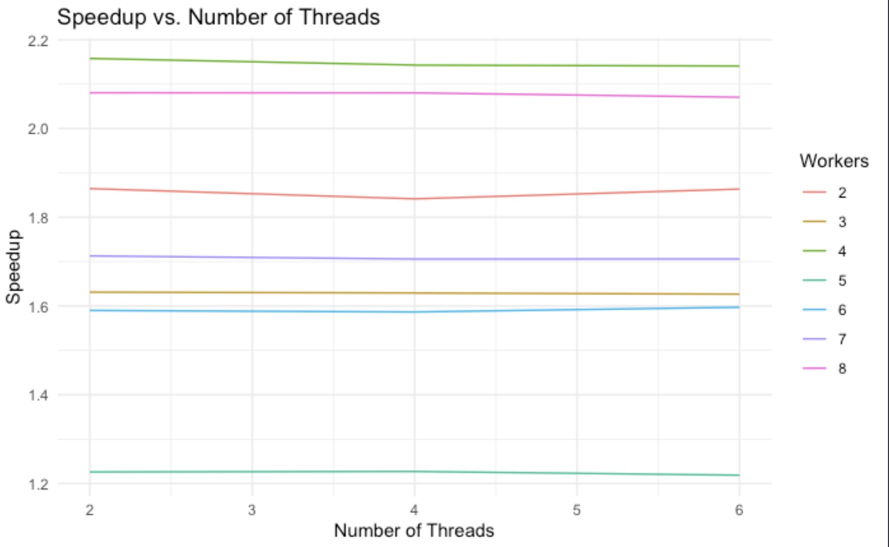
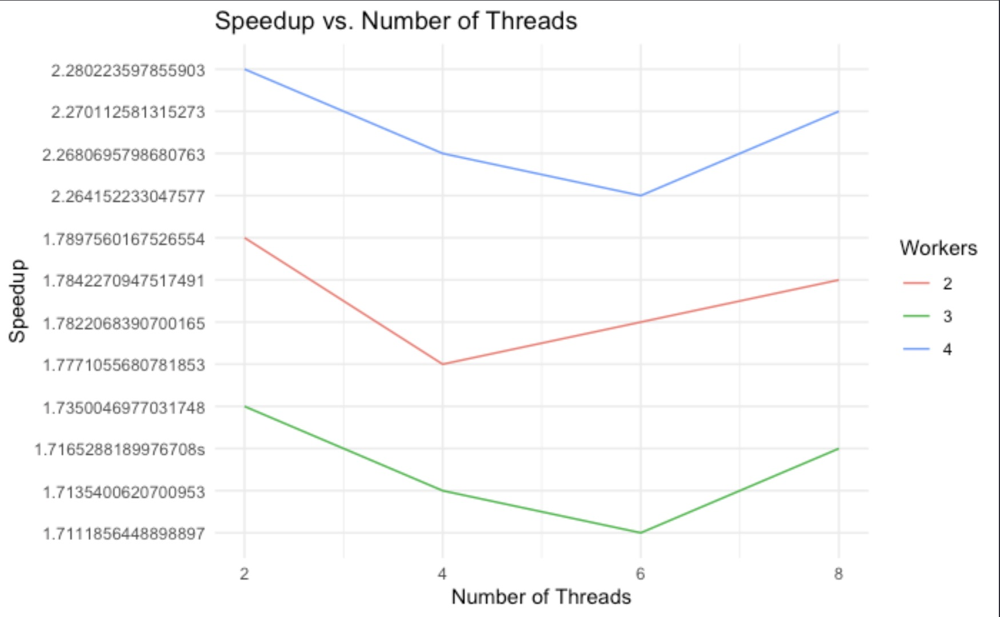
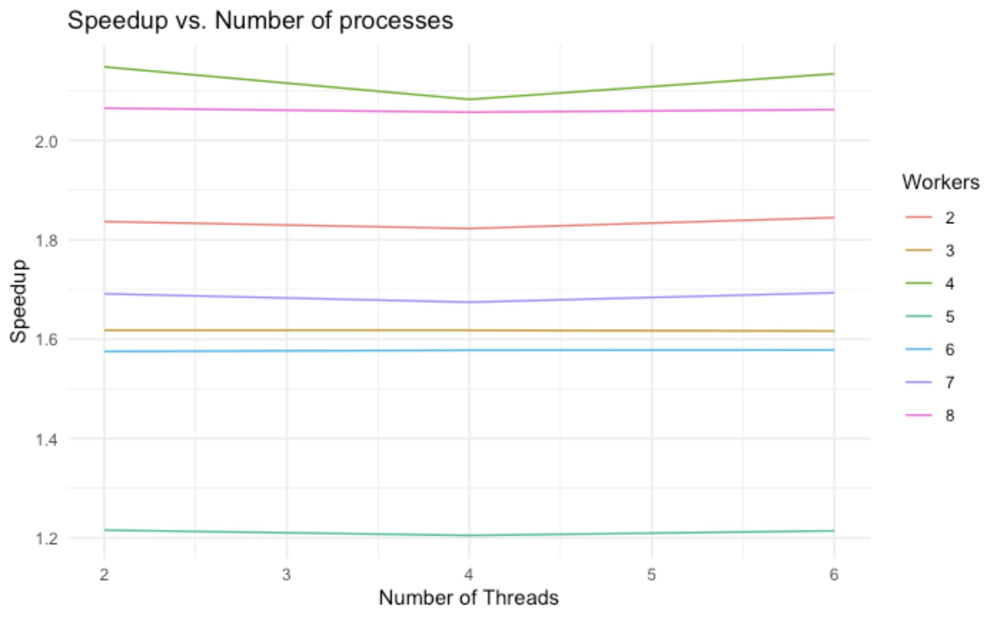

keoni Burns  
CSCI 581

# Final Report

### Problem

the problem I chose was to adapt a pitch shifting program that utilizes the cooley-tukey fast fourier transform. Pitch shifting can be broken down into a couple of portions: Analysis, processing, synthesis, and accumulation. each of the portions are essential to correctly producing either a higher or lower pitch sound while maintaining the original length of the audiofile. The high level overview of how this works is as follows:

_by partitioning the entire wave file into overlapping windows (samples) each overlap should be uniform. After we have our windows we can then use the fourier transform to give us the range of signals or values that each window has. Once this is done we can spread the windows out and use interpolation to fill in our missing values from the given sound samples. after which we can perform the inverse fourier transform on each of our new partitions and add them to our sound sample._

## results

### results for a 1 minute audio clip





### results for a 5 min audio clip




from the graphs you can see that they're fairly consistent amongst different number of threads for the hybrid and the same goes for mpi only. Also as one can expect, the speed increases with the number of nodes used. Suprisingly enough it would appear that 4 nodes and 2 processes tends to outperform any other combination of workers and processses


$$\boxed{speed \ up = {144.652s \over 66.996s} \approx 2.159} $$

given S = 2.159 we can find the amount of the program thats been parallelized using N = 32

$$\boxed{P = { N \times {1-(1 \div S) \over  (N-1)}} \ }$$

$$\boxed{P \approx 0.987}$$
which means that about 98% of the program was parallelized which is good! suspicious but good.

## csv files

these are included in my files and they contain the values for run time as well as number of nodes processes and threads. They were attained through a python script (test.py) which i will include in the zip file.

- it should be noted that the csv's with mpi in the name are solely using mpi instead of a hybrid of both

## verification

unfortunately the math for verifying was much farther out of the scope of my understanding and because of this I had to rely on the audio processing software Audacity and it's estimation of the difference in pitches


apart from these and being able to hear that the pitches are notably different when listening (i will include my wav files) there was no other numerically sound way I found to verify and calculate error percentage

## code

```cpp
void smbFft(double *fftBuffer, long fftFrameSize, long sign) {
    double wr, wi, arg, *p1, *p2, temp;
    double tr, ti, ur, ui, *p1r, *p1i, *p2r, *p2i;
    long i, bitm, j, le, le2, k;

#pragma omp parallel for num_threads(NUM_THREADS) shared(fftBuffer) private(i, bitm, j, p1, p2, temp)
    for (i = 2; i < 2 * fftFrameSize - 2; i += 2) {
        for (bitm = 2, j = 0; bitm < 2 * fftFrameSize; bitm <<= 1) {
            if (i & bitm) j++;
            j <<= 1;
        }
        if (i < j) {
            p1 = fftBuffer + i;
            p2 = fftBuffer + j;
            temp = *p1;
            *(p1++) = *p2;
            *(p2++) = temp;
            temp = *p1;
            *p1 = *p2;
            *p2 = temp;
        }
    }
    for (k = 0, le = 2; k < (long)(log(fftFrameSize) / log(2.) + .5); k++) {
        le <<= 1;
        le2 = le >> 1;
        ur = 1.0;
        ui = 0.0;
        arg = M_PI / (le2 >> 1);
        wr = cos(arg);
        wi = sign * sin(arg);
        for (j = 0; j < le2; j += 2) {
            p1r = fftBuffer + j;
            p1i = p1r + 1;
            p2r = p1r + le2;
            p2i = p2r + 1;
            for (i = j; i < 2 * fftFrameSize; i += le) {
                tr = *p2r * ur - *p2i * ui;
                ti = *p2r * ui + *p2i * ur;
                *p2r = *p1r - tr;
                *p2i = *p1i - ti;
                *p1r += tr;
                *p1i += ti;
                p1r += le;
                p1i += le;
                p2r += le;
                p2i += le;
            }
            tr = ur * wr - ui * wi;
            ui = ur * wi + ui * wr;
            ur = tr;
        }
    }
}
```

```cpp
#pragma omp parallel for num_threads(threads)
        for (i = 0; i < audio.getNumSamplesPerChannel(); i++) {
            // cout << setprecision(15) << global_outdata[i] << endl;

            out[0][i] = global_outdata[i];
        }
        audio.setAudioBufferSize(audio.getNumChannels(), audio.getNumSamplesPerChannel());
        audio.setAudioBuffer(out);
        audio.setSampleRate(sampleRate);
        audio.save(outfile);
```

these are the only two portions of the code i could run openmp on without either getting significant slowdown or terrible audio

i had to use private variables for the fft otherwise it would cause the audio to sound like static
